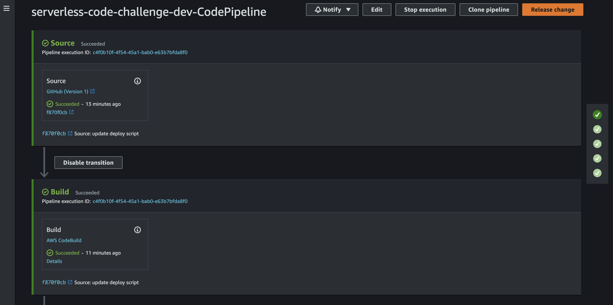
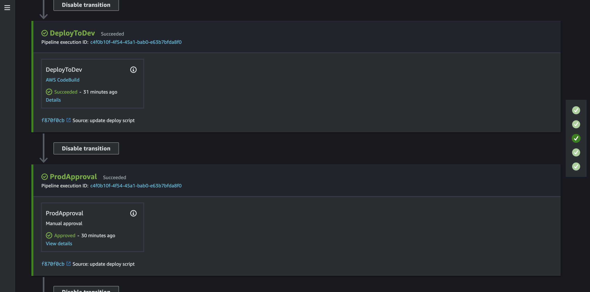
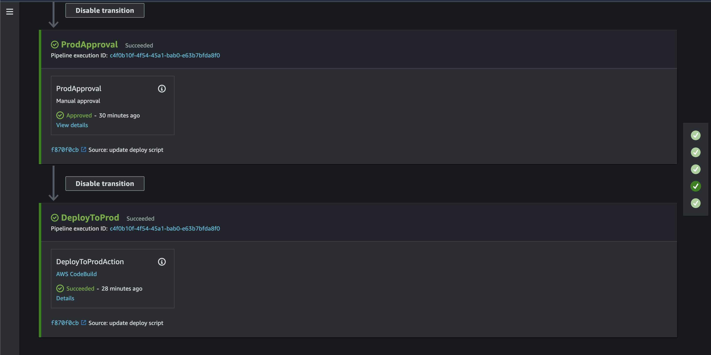

# ⚡️ Serverless Code Challenge

## Background

This repo contains the solution to the [Serverless Guru Code Challnge](https://github.com/serverless-guru/code-challenges/tree/master/code-challenge-5). The challenge is to create an AWS API Gateway CRUD REST API using the serverless framework IaC.

The serverless framework provision the following AWS Services below:

1. REST API Gateway
1. Lambda Functions
1. DynamoDb Table
1. Multi-Stage CI/CD Pipeline

---

The CI/CD Pipeline consists of the following 5 stages.

- Source & Build
  

- Deploy to Dev & Prod Approval
  

- Deploy to Prod
  

## Challenges

Some of the problems I encountered while solving the challenge are:

- Determining the adequate IAM Policies needed for the Code Build Project while still trying to follow AWS least privilege principle
- Understanding the syntax of the Serverless framework
